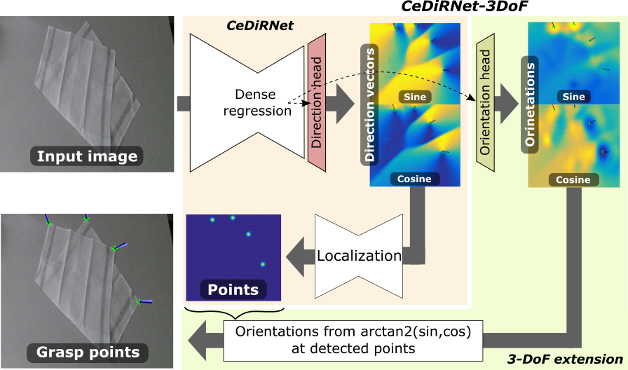
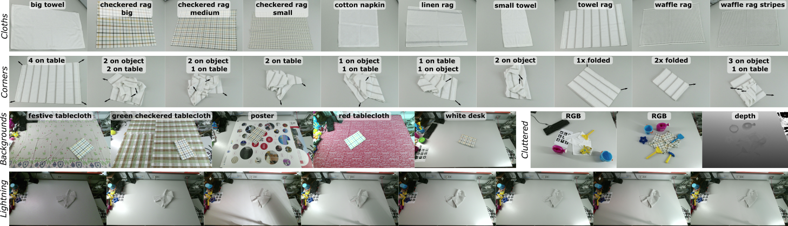

# CeDiRNet-3DoF: Center Direction Network for Grasping Point Localization on Cloths

**:1st_place_medal: Winning method from the [Cloth Manipulation and Perception Challange from ICRA 2023](https://www.iri.upc.edu/groups/perception/ClothManipulationChallenge/)**

**:2nd_place_medal: Second place on [Cloth Competition from ICRA 2024](https://airo.ugent.be/cloth_competition/)**

**[Visual Cognitive System Lab, ViCoS - UL, FRI - Ljubljana](https://vicos.si/research/)**


[Domen Tabernik](https://www.vicos.si/people/domen_tabernik/), [Jon Muhovič](https://www.vicos.si/people/jon_muhovic/), Matej Urbas, [Danije Skočaj](https://www.vicos.si/people/danijel_skocaj/)

[[`Paper`]()] [[`Pre-print paper`](https://prints.vicos.si/publications/424/dense-center-direction-regression-for-object-counting-and-localization-with-point-supervision)]  [[`BibTeX`](#citation)]


|  |  |  |
|:---:|:---:|:---:|
## Citation

If using CeDiRNet-3DoF or ViCoS Towel Dataset please cite our paper using the following BibTeX entry:

```bibtex
@article{TabernikRAL2024,
  title = {Center Direction Network for Grasping Point Localization on Cloths},
  journal = {IEEE Robotics and Automation Letters},
  author = {Domen Tabernik and Jon Muhovič and Matej Urbas and Danijel Skočaj}
}
```


## Benchmark on ViCoS Towel Dataset and available models:
 
| Model | Backbone | Input modalaties | Training datasets | Performance (F1@20px) | DOWNLOAD | 
| ----- | ---------------- | ---------------- | ----------------- | ---- | ---- |
| CeDiRNet-3DoF | ConvNext-L | RGB | ViCoS Towel Dataset + MuJoCo | 78.4% | [MODEL](https://box.vicos.si/skokec/rtfm/CeDiRNet-3DoF/ConvNext-L-RGB.pth) |
| CeDiRNet-3DoF | ConvNext-L | RGB-D | ViCoS Towel Dataset + MuJoCo | 81.4% | [MODEL](https://box.vicos.si/skokec/rtfm/CeDiRNet-3DoF/ConvNext-L-RGB-D.pth) |
| CeDiRNet-3DoF | ConvNext-B | RGB | ViCoS Towel Dataset + MuJoCo | 78.0% | [MODEL](https://box.vicos.si/skokec/rtfm/CeDiRNet-3DoF/ConvNext-B-RGB.pth) |
| CeDiRNet-3DoF | ConvNext-B | RGB-D | ViCoS Towel Dataset + MuJoCo | 80.8% | [MODEL](https://box.vicos.si/skokec/rtfm/CeDiRNet-3DoF/ConvNext-B-RGB-D.pth) |
| CeDiRNet-3DoF | Localization network only | RGB | Synthetic | - |[MODEL](https://box.vicos.si/skokec/rtfm/CeDiRNet-3DoF/localization_checkpoint.pth) |
| [DINO](https://github.com/IDEA-Research/DINO) | ConvNext-B | RGB | ViCoS Towel Dataset + MuJoCo | 72.7% | - |
| [DeformDETR](https://github.com/fundamentalvision/Deformable-DETR) | ConvNext-B | RGB | ViCoS Towel Dataset + MuJoCo | 71.6% | - |
| [Mask R-CNN](https://github.com/facebookresearch/detectron2) | ResNext101 | RGB | ViCoS Towel Dataset + MuJoCo | 78.3% | - |
| [Lips et at. 2024](https://github.com/tlpss/synthetic-cloth-data) | ConvNext-B | RGB | ViCoS Towel Dataset + MuJoCo | 65.7% | - |
| [DETR](https://github.com/facebookresearch/detr) | ConvNext-B | RGB | ViCoS Towel Dataset + MuJoCo | 61.2% | - |
| [CenterNet++](https://arxiv.org/abs/2204.08394) | ResNext101 | RGB | ViCoS Towel Dataset + MuJoCo | 49.4% | - |
| [YOLOv7](https://github.com/facebookresearch/detr) | yolov7x | RGB | ViCoS Towel Dataset + MuJoCo | 48.3% | - |

For benchmark on additional models see our RA-L 2024 paper.

## ViCoS Towel Dataset 

**[DOWNLOAD - Real-world samples (10GB)](https://go.vicos.si/toweldataset)**

**[DOWNLOAD - Synthetic/MuJoCo samples (4GB)](https://go.vicos.si/towelmujocodataset)**

We introduce ViCoS Towel Dataset for benchmarking grasping models, composed of 8000 RGB-D images using:
 * 10 towels from [Household Cloth Objects](https://www.iri.upc.edu/groups/perception/ClothObjectSet/):
 * 10 different configurations of towels
 * 5 backgrounds
 * 8 lightnings
 * with and without clutter

We also provide a dataset with over 12000 synthetic images generated using MuJoCo for pre-training.



## Installation

Dependency:
 * Python >= 3.8
 * PyTorch >= 1.9
 * [segmentation_models_pytorch](https://github.com/qubvel/segmentation_models.pytorch) and [timm](https://pypi.org/project/timm/)
 * opencv-python
 * numpy, scipy, scikit_image, scikit_learn

See `requirements.txt` for a detailed list of pip package dependencies.

Recommended using Conda and installing dependencies as: 

```bash
conda create -n=CeDiRNet-py3.8 python=3.8
conda activate CeDiRNet-py3.8

# install correct pytorch version for CUDA, e.g., for CUDA 11.1:
pip install torch==1.9.1+cu111 torchvision==0.10.1+cu111 torchaudio==0.9.1 -f https://download.pytorch.org/whl/torch_stable.html

pip install -r requirements.txt
```

## Usage

Inference of images from folder:
```bash
python infer.py --input_folder /path/to/images --img_pattern "*.png" --output_folder out/ --config src/config/config_infer.json --model path/to/checkpoint.pth

# Usage: infer.py [-h] [--input_folder INPUT_FOLDER] [--img_pattern IMG_PATTERN]
#                 [--output_folder OUTPUT_FOLDER] [--config CONFIG]
#                 [--model MODEL] [--localization_model LOCALIZATION_MODEL]
# 
# Process a folder of images with CeDiRNet.
# 
# optional arguments:
#   -h, --help            show this help message and exit
#   --input_folder INPUT_FOLDER
#                         path to folder with input images
#   --img_pattern IMG_PATTERN
#                         pattern for input images
#   --output_folder OUTPUT_FOLDER
#                         path to output folder
#   --config CONFIG       path to config file
#   --model MODEL         path to model checkpoint file
#   --localization_model LOCALIZATION_MODEL
#                         (optional) path to localization model checkpoint file
#                         (will override one from model)
```

Pre-train on synthetic MuJoCo data:

```bash

# move to src folder
cd src 

export DATASET=mujoco
export MUJOCO_DIR="../dataset/MuJoCo/"  # path to MuJoCo images from ViCoS Towel dataset
export OUTPUT_DIR="../exp"              # optionally provided path to output dir used in src/config/mujoco/train.py (defaults to '../exp')
export USE_DEPTH=False 

# download the localization network to ./models/ folder
./scripts/download_localization_model.sh

python train.py --config model.kwargs.backbone=tu-convnext_large \
                         train_dataset.batch_size=8 \
                         train_dataset.hard_samples_size=16 \                         
                         pretrained_center_model_path="../models/localization_checkpoint.pth" \
                         display=True
```

For training and evaluation on ViCoS Towel Dataset:

```bash
# move to src folder
cd src 

export DATASET=vicos_towel                                     # defines which config to use (see src/config/__init__.py)
export VICOS_TOWEL_DATASET_DIR="../dataset/ViCoSTowelDataset"  # path to 'ViCoSTowelDataset' folder
export OUTPUT_DIR="../exp"                                     # optionally provided path to output dir used in src/config/vicos_towel/*.py  (defaults to '../exp')

export USE_DEPTH=False  # export this env var to enable/disable using depth in the model
export TRAIN_SIZE=768   # export this env var to define training size (will be TRAIN_SIZE x TRAIN_SIZE)
export TEST_SIZE=768    # export this env var to define testing size (will be TRAIN_SIZE x TRAIN_SIZE)

# training on whole train set
python train.py --config model.kwargs.backbone=tu-convnext_large \
                         train_dataset.batch_size=4 \
                         n_epochs=10 \
                         pretrained_model_path="../models/localization_checkpoint.pth" \
                         display=True

# testing on whole test set for the last epoch
python test.py --config model.kwargs.backbone=tu-convnext_large \
                        eval_epoch="" \
                        train_settings.n_epochs=10 \
                        display=False

```
See config files in `src/config` for more details on configuration. Note, that using `--config` in command line will override settings from files.

### Adding new dataset

You may add new dataset by providing config files and dataset class:
 * add dataset class to `src/datasets/NEW_DATASET.py` and update `src/datasets/__init__.py` 
 * add `train.py` and `test.py` config files to `src/config/NEW_DATASET` and update `src/config/__init__.py`

## Running experiments from paper

Scripts for running experiments related to the paper are in `./scripts/EXPERIMENTS_*.sh`. Please edit the following configurations before first use:

 * edit input/output paths and Conda environment in `./scripts/run_local.sh`
   * set `ROOT_DIR` to CeDiRNet code
   * set `CONDA_HOME` to conda home folder that contains `etc/profile.d/conda.sh`
  * edit `GPU_LIST` env var in `./scripts/EXPERIMENTS_*.sh` for distributed run:   
   ```
    # for distributed MULTI-GPU training set multiple servers/GPUs in the same quote, 
    # e.g., parallel running 2 trainings, each with 4 GPUs:
    GPU_LIST=("server_hostname_A:0,1 server_hostname_B:0,1" \
               "server_hostname_C:0,1 server_hostname_D:0,1")  
    
    # for distributed SINGLE-GPU inference/training set single server/GPU in the same quote, 
    # e.g., parallel running 6 inferences/training, each with 1 GPU:
    GPU_LIST=("server_hostname_A:0" \
              "server_hostname_A:1" \
              "server_hostname_B:0" \
              "server_hostname_B:1" \
              "server_hostname_C:0" \
              "server_hostname_C:1")
   ```
  
Note that changing the number of GPUs used may require updating the batch size. 

Download and extract ViCoS Towel Dataset into `./datasets` subfolder and run experiments: 

```bash
cd scripts/

# Run training and evaluation on ViCoS Towel Dataset:
./EXPERIMENTS_MAIN.sh

# Run ablation study
./EXPERIMENTS_ABLATION.sh
```

By default, scripts will use run_distributed.sh that will delegate work to different GPUs on different servers (for testing) or will execute distributed training by running train.py on each server with the appropriate `WORLD_SIZE` and `RANK_OFFSET` env vars.

For running on single server, just use `localhost` for server name in `SERVERS` and `GPU_LIST`.
